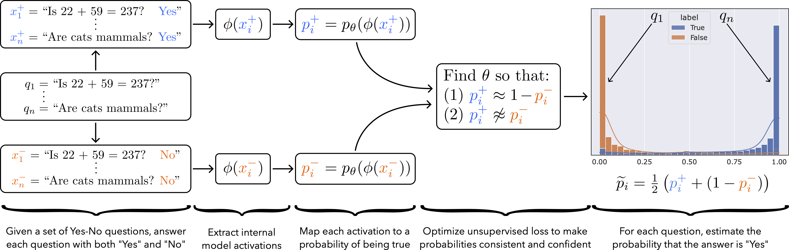

# Discovering Latent Knowledge Without Supervision

This repository contains the essential code for Discovering Latent Knowledge in Language Models Without Supervision.

<p align="center">

</p>

We introduce a method for discovering truth-like features directly from model activations in a purely unsupervised way.

## Abstract
> Existing techniques for training language models can be misaligned with the truth: if we train models with imitation learning, they may reproduce errors that humans make; if we train them to generate text that humans rate highly, they may output errors that human evaluators can't detect. We propose circumventing this issue by directly finding latent knowledge inside the internal activations of a language model in a purely unsupervised way. Specifically, we introduce a method for accurately answering yes-no questions given only unlabeled model activations. It works by finding a direction in activation space that satisfies logical consistency properties, such as that a statement and its negation have opposite truth values. We show that despite using no supervision and no model outputs, our method can recover diverse knowledge represented in large language models: across 6 models and 10 question-answering datasets, it outperforms zero-shot accuracy by 4\% on average. We also find that it cuts prompt sensitivity in half and continues to maintain high accuracy even when models are prompted to generate incorrect answers. Our results provide an initial step toward discovering what language models know, distinct from what they say, even when we don't have access to explicit ground truth labels.

## Code

We provide three options for code:
1. A notebook walking through our main method in a simple way: `CCS.ipynb`. This may be the best place to start if you want to understand the method better and play around with it a bit.
2. More flexible and efficient scripts for using our method in different settings: `generate.py` and `evaluate.py` (both of which rely heavily on `utils.py`). This code is a polished and simplified version of the code used for the paper. This may be the best place to build on if you want to build on our work.
3. You can also download the original (more comprehensive, but also more complicated and less polished) code [here](https://openreview.net/attachment?id=ETKGuby0hcs&name=supplementary_material).

Below we provide usage details for our main python scripts (`generate.py` and `evaluate.py`).

### Generation
First, use `generate.py` for (1) creating contrast pairs, and (2) generating hidden states from a model. For example, you can run:
```
python generate.py --model_name deberta  --num_examples 400 --batch_size 40
```
or
```
python generate.py --model_name gpt-j --num_examples 100 --batch_size 20
```
or
```
CUDA_VISIBLE_DEVICES=0,1 python generate.py --parallelize --model_name t5-11b --num_examples 100 
```

To use the decoder of an encoder-decoder model (which we found is worse than the encoder for T5 and UnifiedQA, but better than the encoder for T0), specify `--use_decoder`.

There are also many optional flags for specifying the dataset (`--dataset`; the default is `imdb`), the cache directory for model weights (`--cache_dir`; the default is `None`), which prompt for the dataset to use (`--prompt_idx`; the default is `0`), where to save the hidden states for all layers in the model (`--all_layers`), and so on.

### Evaluation 
After generating hidden states, you can use `evaluate.py` for running our main method, CCS, on those hidden states. Simply run it with the same flags as you used when running `generate.py`, and it will load the correct hidden states for you. For example, if you ran `generate.py` with DeBERTa, generating 400 examples with a batch size of 40 (the first example in the Generation section), then you can run:
```
python evaluate.py --model_name deberta  --num_examples 400 --batch_size 40
```

In addition to evaluating the performance of CCS, `evaluate.py` also verifies that logistic regression (LR) accuracy is reasonable. This can diagnose why CCS performance may be low; if LR accuracy is low, that suggestions that the model's representations aren't good enough for CCS to work well.

### Requirements

This code base was tested on Python 3.7.5 and PyTorch 1.12. It also uses the [datasets](https://pypi.org/project/datasets/) and [promptsource](https://github.com/bigscience-workshop/promptsource) packages for loading and formatting datasets. 

## Citation

If you find this work helpful, please consider citing our paper:

    @article{burns2022dl,
      title={Discovering Latent Knowledge in Language Models Without Supervision},
      author={Burns, Collin and Ye, Haotian and Klein, Dan and Steinhardt, Jacob},
      journal={ArXiV},
      year={2022}
    }

